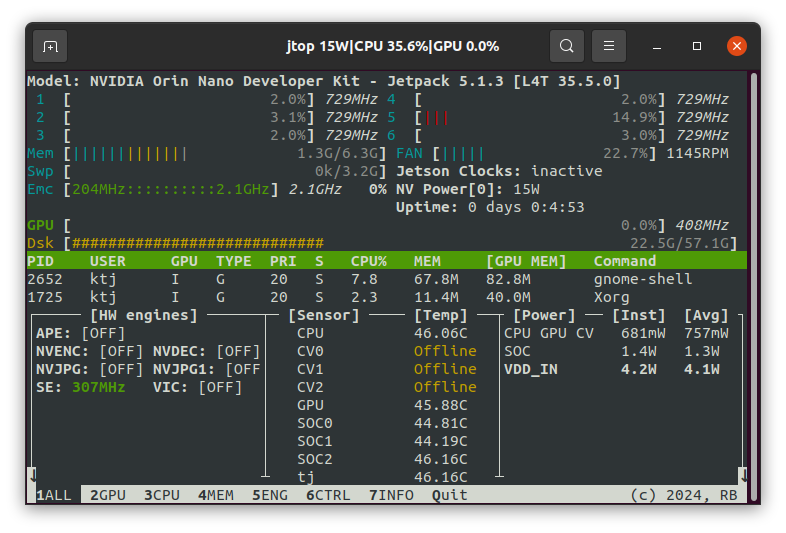
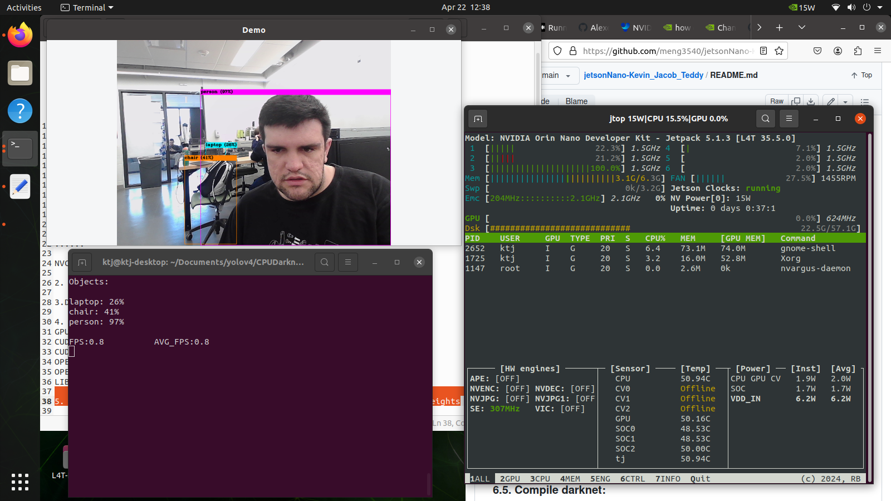
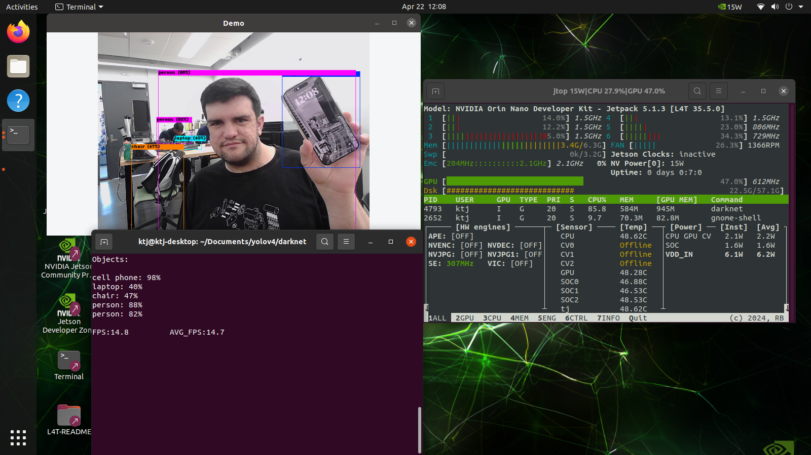

# jetsonNano-Kevin_Jacob_Teddy

## 1.  Goal

The aim of the project is to use the NVIDIA Jetson Orin Nano to implement object detection in an image, video, or live camera feed. The task of feeding data into an AI model to get an output is referred to as inferencing. This task has multiple ways it may be parallelizable. If the input images for the object detection come from a non-real-time source (like an image or video file) then the inference task can be parallelized by running inference on multiple images or frames of video at once. For real-time sources like a camera, the inference may be done on tiles of the input image. This can allow a large image to be processed faster. However, as real-time sources only provide new frames as time progresses, the whole process cannot be sped up simply by running inference on more frames at once.

Our group does have experience training and running inference on AI classification models, however, we have not written one entirely from scratch or utilized parallel programming. Our group also has experience working in Linux, the operating system running on the Jetson, and some experience working with edge devices like Raspberry Pi. As such, the setup and use of the Jetson Nano is not expected to be overly difficult. Interfacing with the camera on the Jetson may prove to be the most difficult aspect. 

## 2. Proposed solution

Our proposed solution will use a webcam connected to the Jetson. This will feed images into Python, which will be picked up by OpenCV. Some image processing may be applied to the image to aid in inference, and then the image will be passed to the YOLOv8 pre-trained model. This model will return the detected objects and their locations on screen. Implementing some more OpenCV code will allow us to draw boxes around the detected objects and label them.

JetPack includes Jetson Linux with bootloader, Linux kernel, Ubuntu desktop environment, and a complete set of libraries for acceleration of GPU computing, multimedia, graphics, and computer vision. It also includes samples, documentation, and developer tools for both the host computer and developer kit, and supports higher-level SDKs such as DeepStream for streaming video analytics, Isaac for robotics, and Riva for conversational AI.

Setting up the edge device will be performed by flashing the Jetpack SDK onto an SD card. The Jetson will be connected via a serial connection over USB which will allow for the first-time setup to be completed. We have used a terminal emulator like PuTTY (Serial, speed 115200, with the right COM port) to connect to the Jetson Nano for the initial setup. Once the Linux environment was set up and run for the first time, we were able to connect a keyboard, mouse, and monitor to continue setting up YOLO on our Jetson Nano. 

## 3. Set up prepare 

### 3.1. Write Image to the microSD Card

To prepare your microSD card, you’ll need a computer with an Internet connection and the ability to read and write SD cards, either via a built-in SD card slot or adapter.

1. Download the Jetson Nano Developer Kit SD Card Image, and note where it was saved on the computer.
2. Write the image to your microSD card by following the instructions in the link below according to your computer’s operating system: Windows, macOS, or Linux.

<a href="https://developer.nvidia.com/embedded/learn/get-started-jetson-nano-devkit#write">Get Started With Jetson Nano Developer Kit | NVIDIA Developer</a>

### 3.2. Setup and First Boot

There are two ways to interact with the developer kit: 

1. With display, keyboard, and mouse attached, We will be using this method.
2. In “headless mode” via a connection from another computer. 

## 4. Setup Steps

1. Unfold the paper stand and place it inside the developer kit box.
2. Insert the microSD card (with the system image already written to it) into the slot on the underside of the Jetson Nano module.
3. Initial Setup Headless Mode - insert microSD card
4. Set the developer kit on top of the paper stand.
5. Check the Jetson Nano Developer Kit User Guide for the location of the J48 Power Select Header and J25 Power Jack.
6. Jumper the J48 Power Select Header pins.
7. Connect your other computer to the developer kit’s Micro-USB port.
8. Connect a DC power supply to the J25 Power Jack. The developer kit will power on automatically.
9. Allow 1 minute for the developer kit to boot.
10. On your other computer, use the serial terminal application to connect via the host serial port to the developer kit.

Once connected to the developer kit, hit SPACE if the initial setup screen does not appear automatically.

### 4.1. First Boot

A green LED next to the Micro-USB connector will light as soon as the developer kit powers on. When you boot the first time, the developer kit will take you through some initial setup, including:

- Review and accept NVIDIA Jetson software EULA
- Select system language, keyboard layout, and time zone
- Create a username, password, and computer name
- Select APP partition size—it is recommended to use the max size suggested

## 5 Deploying Darknet with YOLOv4 on GPU and CPU

### 5.1 Step 1: CPU VERSION
```bash
GPU=0
CUDNN=0
CUDNN_HALF=0
OPENCV=1
OPENMP=1
LIBSO=1
```
### 5.2 Step 2: Run Make
```bash
make
```
### 5.3 Step 3: Run Darknet
```bash
./darknet  detector demo cfg/coco.data cfg/yolov4-tiny.cfg yolov4-tiny.weights -c 0
```
### 5.4 Step 4: Install and Run performance tools
```bash
sudo jetson_clocks //set clock speeds to max
sudo nvpmodel -m 0 //set jetson to max power
sudo apt update
sudo pip install jetson-stats
sudo reboot
jtop
```

### 5.5 Step 5: Clone Darknet and enter folder
```bash
git clone https://github.com/AlexeyAB/darknet.git
cd darknet
```

### 5.6 Step 6: Edit Makefile
```bash
nano Makefile

GPU=1
CUDNN=1
CUDNN_HALF=1
OPENCV=1
AVX=0
OPENMP=1
LIBSO=1
ZED_CAMERA=0
ZED_CAMERA_v2_8=0

......

USE_CPP=0
DEBUG=0

ARCH= -gencode arch=compute_53,code=[sm_53,compute_53]

......

NVCC=/usr/local/cuda/bin/nvcc
```

### 5.7 Step 7: Run Make
```bash
make
```

### 5.8 Step 8: Download yolov4-tiny.weights
```bash
wget https://github.com/AlexeyAB/darknet/releases/download/darknet_yolo_v4_pre/yolov4-tiny.weights
```
### 5.9 Step 9: Test
```bash
./darknet  detector demo cfg/coco.data cfg/yolov4-tiny.cfg yolov4-tiny.weights -c 0
jtop
```

## 6 Results

## 6.1 Darknet CPU Only

To provide a baseline to compare against, a screenshot of jtop while the jetson was idle was taken. Note how the speeds of the CPU cores are 729MHz. This indicates that jetson_clocks has not been run, forcing all the clocks to maximum.



Running the model on the CPU was incredibly slow. Even after setting the Jetson to maximum power with the nvpmodel and jetson_clocks commands, the frame rate of the detections was unusable at 0.8FPS. It can be seen from jtop that the model is only running on a single CPU core, and is not utilizing the GPU. Note how the CPU clock speed for the core in use is running at 1.5MHz, the maximum, as well as a few other cores with recent activity. Running jetson_clocks will not increase the clock speed of the core in use by darknet any higher, though it would force the other cores to stay at 1.5MHz, possibly resulting in better system responsiveness. Darknet would not run any faster though. 


## 6.2 Darknet GPU
Darknet was recompiled this time with settings to enable the GPU to be used. The model was run again. A very large performance boost was seen, as the displayed image updated in real-time and the FPS of the inference shot up to 14FPS. This is perhaps slower than ideal for some use cases where fast detection may be critical (such as self-driving cars or driver assist features), but certainly useable.



## 7 Reflection and Learning Plan

### 7.1 Reflection
Our solution, as we had planned to implement it was not really successful. Running the YOLO models through custom Python code with Pytorch or TensorRT on the GPU proved to be very difficult and fraught with compilation errors, missing wheels, and other errors. Our versions of Pytorch and TensorRT were not compiled with CUDA support, and attempting to compile them with CUDA was too complex for the short timespan we had with the Jetson. After much searching, testing, experimenting, and restarting, we were able to deploy a solution using AlexeyAB's Darknet YOLOv4 framework. This framework, written in C was able to make use of NVCC and CUDNN to run the pre-trained YOLO models on the GPU.

During our exploration, of YOLO and running GPU-accelerated applications on the Jetson, we learned several things that can be applied to our future areas of study:

-Available pre-trained object detection models (YOLO)
-How to compile programs from source
-The importance of matching packages to the system architecture
-The speedup afforded by running tasks on hardware specialized for those types of workloads, eg. GPU
-How to deploy a headless machine and connect to it via serial (although we eventually switched to a graphical environment due to networking issues)
-Some learning regarding the types of formats AI models can be available in, such as .engine (TensorRT) and ONNX (open framework for defining machine learning models)

### 7.2 Learning Plan

#### 7.2.1 Jacob
The main difficulty we ran into was the lack of GPU support in the versions of PyTorch and TensorRT that were installed or able to be installed on the jetson. Despite finding multiple tutorials on the subject, and even following Ultralytics own guide to run YOLO on the Jetson, we were unable to deploy YOLO using Python. Learning more about why the GPU versions of these libraries would not install would allow us to fix that problem and then implement our own deployment of YOLO in Python as we originally set out to do. Our solution also relied on a pre-trained model. The next step to make a useful prototype might require training the model on custom data so that it can recognize objects we want it to that were not part of the original training data. Learning how to do this for YOLO would be valuable. 

### 7.2.2 Kevin (Kuan-Yu)
To take this project further, we would like to learn how to train a custom model. This will allow the model to predict other objects that might be needed for the final implementation of this solution. We would like to explore using OpenACC or other methods introduced in class to try to accelerate Darknet further. Next, we need to address the issue of PyTorch not detecting the GPU. Being able to use Python libraries like PyTorch and TensorRT would allow us to get further in developing our own [Python code](src/project.py) to perform the inferencing. Lastly, learning how to implement the model inferencing in CUDA C is an area we would like to explore. Writing the code directly in C might help avoid some of the issues encountered with Python as well as allow for the application of optimization strategies learned in class.

### 7.2.3 Tewodros

# _Steps we tried_ 
___
We tried several methods to run a model on the GPU. Many methods ran into errors that could not be fixed within the timeframe for this project. These attempts are documented below for reference and are potential areas to explore for additional ways of achieving the goal and increasing the inference speed.

## 1. Initial Setup Headless Mode

To complete setup when no display is attached to the developer kit, you’ll need to connect the developer kit to another computer and then communicate with it via a terminal application (e.g PuTTY, Serial, speed 115200, with the right COM port) to handle the USB serial communication on that other computer.

Note: Headless initial configuration requires the developer kit to be powered by a DC power supply with a barrel jack connector since the Micro-USB port is required to access the initial configuration prompts.

## 2. Ultralytics YOLOv8

### 2.1. Step 1

Access the terminal of the Jetson device, install pip, and upgrade it

```clike
sudo apt update
sudo apt install -y python3-pip
pip3 install --upgrade pip
```


### 2.2. Step 2

Clone the following repo

```clike
git clone https://github.com/ultralytics/yolov8
```


### 2.3. Step 3

Open requirements.txt

```clike
cd yolov5
vi requirements.txt
```


### 2.4. Step 4

Edit the following lines. Here you need to press i first to enter editing mode. Press ESC, then type :wq to save and quit

```clike
# torch>=1.8.0
# torchvision>=0.9.0
```


Note: torch and torchvision are excluded for now because they will be installed later.

### 2.5. Step 5

Install the below dependency

```clike
sudo apt install -y libfreetype6-dev
```


### 2.6. Step 6

Install the necessary packages

```clike
pip3 install -r requirements.txt
```
### 2.7 Step 7
To implement YOLO in Python, we wrote the following code:
```python
from ultralytics import YOLO
import cv2
import torch

camera = cv2.VideoCapture(0)

model = YOLO('yolov8n.pt')
model.export(format='engine', device='gpu')

tRT_model = YOLO('yolov8n.engine')

print (torch.cuda.is_available())
while (True):
    ret, frame = camera.read() 
    results = trt_model(frame)
    
    if cv2.waitkey(100) & 0xFF == ord('q'):
        break
vid.realease()
cv2.DestroyAllWindows()
```

## 3. PyTorch and Torchvision on ARM Architecture (Jetson Platform)

We cannot install PyTorch and Torchvision from pip because they are not compatible to run on the Jetson platform which is based on ARM aarch64 architecture. Therefore, we need to manually install a pre-built PyTorch pip wheel and compile/ install Torchvision from source.

### 3.1. Step 1

Install torch according to your JetPack version in the following format

```clike
wget <URL> -O <file_name>
pip3 install <file_name>
```


#### 3.1.1. Example

Here we are running JP5.1, and therefore we choose PyTorch v1.10.0

```clike
cd ~
sudo apt-get install -y libopenblas-base libopenmpi-dev
wget https://nvidia.box.com/shared/static/fjtbno0vpo676a25cgvuqc1wty0fkkg6.whl -O torch-1.10.0-cp36-cp36m-linux_aarch64.whl
pip3 install torch-1.10.0-cp36-cp36m-linux_aarch64.whl
```


#### 3.1.2. Step 2

Install torchvision depending on the version of PyTorch that you have installed. For example, we chose PyTorch v1.10.0, which means, we need to choose Torchvision v0.11.1

```clike
sudo apt install -y libjpeg-dev zlib1g-dev
git clone --branch v0.11.1 https://github.com/pytorch/vision torchvision
cd torchvision
sudo python3 setup.py install
```


Here is a list of the corresponding torchvision versions that you need to install according to the PyTorch version:

- PyTorch v1.10 - torchvision v0.11.1
- PyTorch v1.12 - torchvision v0.13.0

## 4. DeepStream + YOLOv8

### 4.1. Step 1

Clone the following repo

```clike
cd ~git clone https://github.com/marcoslucianops/DeepStream-Yolo
```


### 4.2. Step 2

Install YOLOv8 and other requirements

```clike
git clone https://github.com/ultralytics/ultralytics.git
cd ultralytics
pip3 install -r requirements.txt
python3 setup.py install
pip3 install onnx onnxsim onnxruntime
```


It is noted that this is best done in a Python virturalenv.

### 4.3. Step 3

Copy the export_yoloV8.py file from DeepStream-Yolo/utils directory to the ultralytics folder.

### 4.4. Step 4

Download the desired model from YOLOv8’s releases.

```clike
wget https://github.com/ultralytics/assets/releases/download/v0.0.0/yolov8s.pt
```


### 4.5. Step 5

Convert the model to a usable form.

```clike
python3 export_yoloV8.py -w yolov8s.pt --dynamic
```


Note: To change the inference size (default: 640)

```clike
-s SIZE--size SIZE-s HEIGHT WIDTH--size HEIGHT WIDTH
```


Example for 1280:

```clike
-s 1280 
```


or

```clike
-s 1280 1280
```


### 4.6. Step 6

Copy the generated ONNX model and labels.txt (if generated) into the DeepStream-Yolo folder

### 4.7. Step 7

Open the DeepStream-Yolo folder and compile the library

```clike
cd ~/DeepStream-Yolo
CUDA_VER=11.4 make -C nvdsinfer_custom_impl_Yolo # for DeepStream 6.1
CUDA_VER=10.2 make -C nvdsinfer_custom_impl_Yolo # for DeepStream 6.0.1 / 6.0
```


### 4.8. Step 8

Edit the config_infer_primary_yoloV8.txt file according to your model. This example sets the maximum number of detected classes to 80.

```clike
[property]
...
onnx-file=yolov8s.onnx
...
num-detected-classes=80
...
parse-bbox-func-name=NvDsInferParseYolo
...maintain-aspect-ratio=1
symmetric-padding=1
...
```


### 4.9. Step 9

Edit the deepstream_app_config file

```clike
...
[primary-gie]
...
config-file=config_infer_primary_yoloV8.txt
```


### 4.10. Step 10

Change the video source in deepstream_app_config file. Here a default video file is loaded as you can see below

```clike
uri=/opt/nvidia/deepstream/deepstream/samples/streams/sample_1080p_h264.mp4
```


### 4.11. Step 11

```clike
deepstream-app -c deepstream_app_config.txt
```


## 5. YOLOv3 TensorRT Conversion To Use In Custom TensorRT Program

### 5.1. Make sure to have Python 3.8-venv installed and create a virtual environment:

   ```bash
   sudo apt-get install python3.8-venv
   python3.8 -m venv myenv
   source myenv/bin/activate
   ```

### 5.2. Activate the virtual environment:

   ```bash
   source myenv/bin/activate
   ```

### 5.3. Clone the darknet repository:

   ```bash
   git clone <darknet_repo_url>
   ```

### 5.4. Edit the darknet Makefile as needed.

### 5.5. Compile darknet:

   ```bash
   cd darknet
   make
   ```

### 5.6. Download the pre-trained weights for YOLOv3:

   ```bash
   wget <weights_url>
   ```

### 5.7. Run YOLOv3 inference on a test image using darknet:

   ```bash
   ./darknet detector test cfg/coco.data cfg/yolov3.cfg <path_to_weights> <path_to_test_image>
   ```

### 5.8. Install TensorRT conversion requirements:

   ```bash
   sudo apt-get install python3-libnvinfer python3-libnvinfer-dev
   ```

### 5.9. Convert the YOLO model to ONNX format for TensorRT:

   ```bash
   python3 yolo_to_onnx.py
   ```

### 5.10. Move the cfg and weights files to 

   ```bash
   /usr/src/tensorrt/samples/python/yolov3_onnx
   ```

### 5.11. Set TRT_DATA_DIR to 

   ```bash
   TRT_DATA_DIR="/usr/src/tensorrt"
   ```

### 5.12. Modify yolo_to_onnx script to save to a directory with write permission.

### 5.13. Update pip

   ```bash
   pip install --upgrade pip
   ```

### 5.14. Add NVCC to PATH:

   ```bash
   export PATH="/usr/local/cuda/bin:$PATH"
   ```

### 5.15. Install PyCUDA:

   ```bash
   python3 -m pip install pycuda --no-binary :all:
   ```

### 5.16. Edit onnx_to_tensorrt script to save to a writable directory.

### 5.17. Move files as needed (e.g., dog.jpg, yolo.onnx).

### 5.18. Convert the ONNX file to TensorRT format:

   ```bash
   python3 onnx_to_tensorrt.py
   ```

### 5.19. Reconvert the ONNX file according to the instructions at <a href="https://elinux.org/TensorRT/YoloV3">here</a>.
